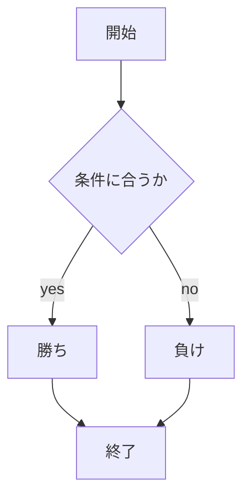
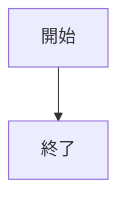
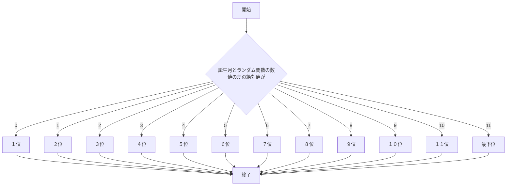
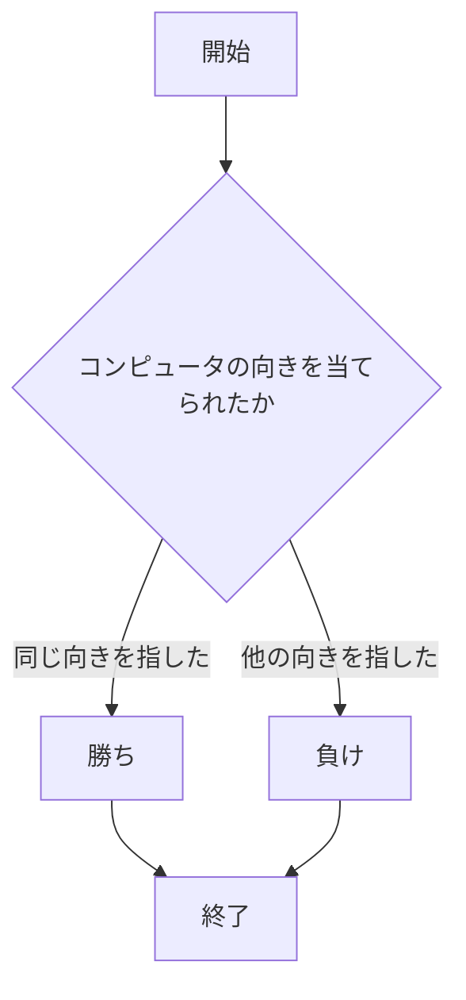

# webpro_06
2024/10/29

## このプログラムについて

## ファイル名 

ファイル名 | 説明
-|-
app5.js | プログラム本体
public/janken.html | じゃんけんの開始画面

```javascript
console.log( 'Hello' );
```





## 運勢を表示するプログラム 

ファイル名 | 説明
-|-
app5.js | プログラム本体
views/unsei.ejs | 今日の運勢の開始画面

誕生月を入力すると今日の運勢を出力するものである
前に制作したものと違い,誕生月を入力することで個人に特化しているように見える.



## あっち向いホイをするプログラム

ファイル名 | 説明
-|-
app5.js | プログラム本体
view/attimuitehoi.ejs | あっち向いてホイの開始画面




