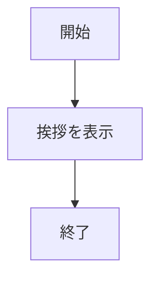
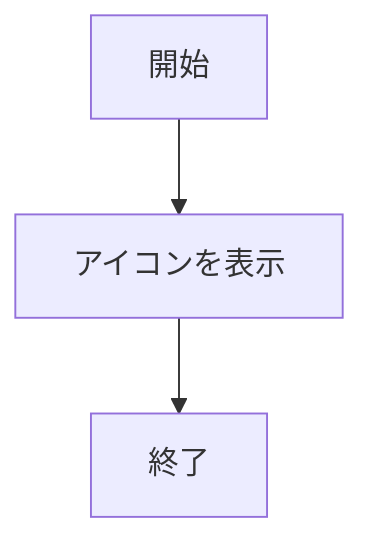
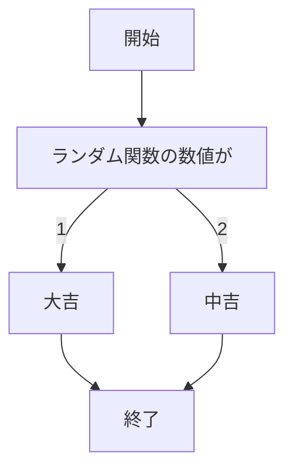
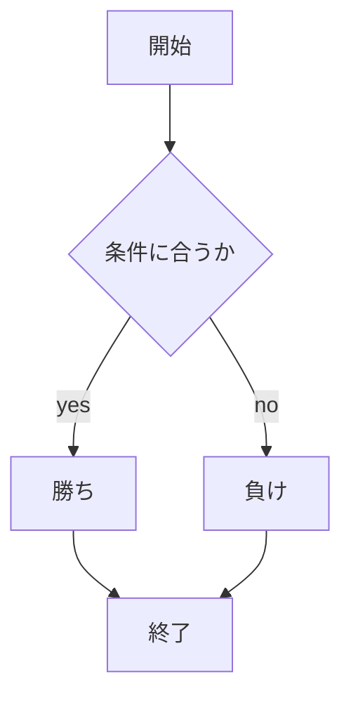
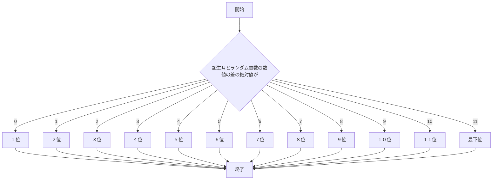
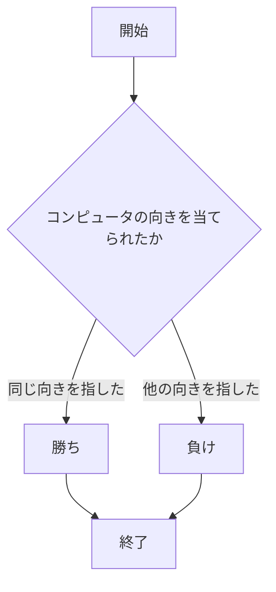

# webpro_06
2024/11/18

## 挨拶を表示するプログラム 

ファイル名 | 説明
-|-
app5.js | プログラム本体
view/show.ejs | 表示画面

1. app5.js を起動する
1. Webブラウザでlocalhost:8080/view/show.ejsにアクセスする

挨拶を定義してURLを開くとHello,WorldとBon Jourと出力されるものである.

## 挨拶を表示するプログラム その２

ファイル名 | 説明
-|-
app5.js | プログラム本体
view/show.ejs | 表示画面

1. app5.js を起動する
1. Webブラウザでlocalhost:8080/view/show.ejsにアクセスする

URLを開くとHello,WorldとBon Jourと出力されるものである.
一つ前の挨拶を表示するプログラムと違うのは,挨拶を定義せずに直接代入しているところである.

## アイコンを表示するプログラム

ファイル名 | 説明
-|-
app5.js | プログラム本体
view/icon.ejs | 表示画面

1. app5.js を起動する
1. Webブラウザでlocalhost:8080/view/icon.ejsにアクセスする

URLを開くとAppleのロゴが出力されるものである.

## 運勢を表示するプログラム

ファイル名 | 説明
-|-
app5.js | プログラム本体
view/luck.ejs | 表示画面

1. app5.js を起動する
1. Webブラウザでlocalhost:8080/view/luck.ejsにアクセスする

URLを開くとランダムに運勢が出力されるものである.

## じゃんけんをするプログラム

ファイル名 | 説明
-|-
app5.js | プログラム本体
view/janken.ejs | じゃんけんの開始画面

1. app5.js を起動する
1. Webブラウザでlocalhost:8080/view/janken.ejsにアクセスする
1.自分の手を入力する

URLを開いて自分の手を入力するとコンピュータとのじゃんけん結果が出力されるものである.

## 運勢を表示するプログラム 

ファイル名 | 説明
-|-
app5.js | プログラム本体
views/unsei.ejs | 今日の運勢の開始画面

1. app5.js を起動する
1. Webブラウザでlocalhost:8080/view/unsei.ejsにアクセスする
1.誕生月を半角数字で入力する

誕生月を入力すると今日の運勢を出力するものである.
前に制作したものと違い,誕生月を入力することで個人に特化しているように見える.

## あっち向いホイをするプログラム

ファイル名 | 説明
-|-
app5.js | プログラム本体
view/attimuitehoi.ejs | あっち向いてホイの開始画面

1. app5.js を起動する
1. Webブラウザでlocalhost:8080/view/attimuitehoi.ejsにアクセスする
1.向く向きを入力する

コンピュータが上下左右どの向きを向くのか当てるゲーム。
上下左右を入力するとコンピュータの向きと同じか判断して同じなら「勝ち」違うのなら「負け」を出力する。

